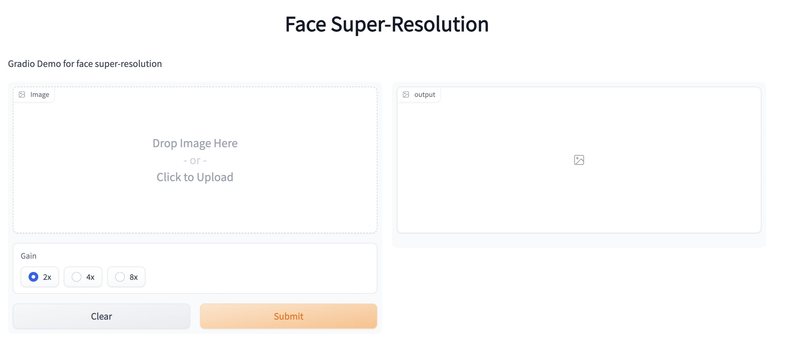

# Face Super-resolution Demo Based on SR3
## Brief
This is a demo for face super-resolution based on SR3 model. It is built by [gradio](https://gradio.app/).

## Usage
You can simply run the demo as following steps:
### 1. Install environment
```python
pip install requirements.txt
```
### 2. Download pretrain model
We randomly sampled 20,000 pictures from a total of 70,000 pictures from [FFHQ](https://github.com/NVlabs/ffhq-dataset) dataset for model training, and the iteration is 1,000,000. You can download our pretrain model via the link below:
<br>[Google Drive](https://drive.google.com/drive/folders/1k7a5ei_QwzShjgcgsIG4a6z00-Wmf7fp?usp=share_link)<br>
After the download is complete, put it in the experiments folder.
### 3. Run app.py
## Demo Screenshot


### Acknowledge
We are benefiting a lot from the following project:
<br>
[Image Super-Resolution via Iterative Refinement](https://github.com/Janspiry/Image-Super-Resolution-via-Iterative-Refinement)

